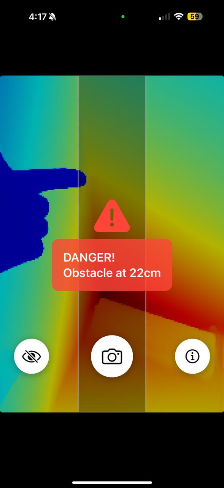

# Eyes
Eyes for iOS by Hefestru Fund

## Project Description

Eyes is an iOS application designed to assist visually impaired individuals in navigating their environment more safely and independently. 

Blind people typically use canes to detect obstacles at ground level, but they can't detect objects that are elevated and don't connect to the ground - like hanging signs, tree branches, or overhead structures. This limitation can lead to collisions and injuries.

Eyes aims to bridge this gap by providing real-time audio feedback about the surrounding environment, helping users detect obstacles at all heights and distances.

## TO-DO

1. Add reference audio for blind people to help them understand their environment through sound cues.
2. Implement artificial intelligence functions to read text from books, signs, products, and other objects in the environment.
3. Add object recognition capabilities to identify and describe common items like:
   - Furniture (chairs, tables, sofas)
   - Household appliances (refrigerators, microwaves, washing machines)
   - Electronic devices (phones, computers, TVs)
   - Food items and packaging
   - Clothing and accessories
   - Transportation vehicles (cars, buses, bicycles)
   - Animals and pets
   - Plants and trees
4. Implement spatial awareness features to describe object locations and distances.